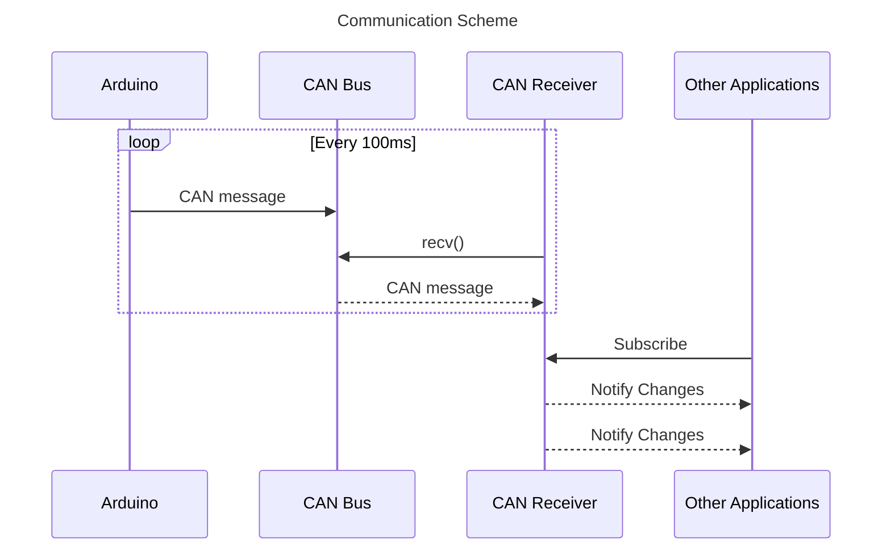

# Can Receiver
This application is responsible for receiving data from the CAN bus and provide received data to other applications via CommonAPI.

# Table of Contents
- [Communication Scheme](#communication-scheme)
- [Build and Install](#build-and-install)
- [FIDL](#fidl)
- [CI/CD](#cicd)
- [References](#references)


## Intro

The main objective of the project is to transform CAN data received from Arduino into a socket format and then use vSomeIP to enable other applications to access Speed and RPM data in real-time.
```
.
├── CMakeLists.txt
├── fidl
│   ├── CanReceiver.fdepl
│   └── CanReceiver.fidl
├── scripts
│   ├── Build.sh
│   └── Run.sh
├── src
│   ├── CanDataRegister.cpp
│   ├── CanDataRegister.hpp
│   ├── CanReceiver.cpp
│   ├── CanReceiver.hpp
│   ├── main.cpp
│   ├── MovingAverageFilter.cpp
│   ├── MovingAverageFilter.hpp
│   ├── SpeedSensorStubImpl.cpp
│   └── SpeedSensorStubImpl.hpp
├── src-gen
│   ├── core
│   │   └── v0
│   │       └── commonapi
│   │           ├── SpeedSensor.hpp
│   │           ├── SpeedSensorProxyBase.hpp
│   │           ├── SpeedSensorProxy.hpp
│   │           ├── SpeedSensorStubDefault.hpp
│   │           └── SpeedSensorStub.hpp
│   └── someip
│       └── v0
│           └── commonapi
│               ├── SpeedSensorSomeIPCatalog.json
│               ├── SpeedSensorSomeIPDeployment.cpp
│               ├── SpeedSensorSomeIPDeployment.hpp
│               ├── SpeedSensorSomeIPProxy.cpp
│               ├── SpeedSensorSomeIPProxy.hpp
│               ├── SpeedSensorSomeIPStubAdapter.cpp
│               └── SpeedSensorSomeIPStubAdapter.hpp
```

### Project Structure

The project directory is structured as follows:

- `CMakeLists.txt`: Contains the CMake configuration for building the project.
- `fidl`:
  - `CanReceiver.fdepl`: Deployment file for the CAN Receiver.
  - `CanReceiver.fidl`: FIDL (Franca IDL) interface description for the CAN Receiver.
- `scripts`:
  - `Build.sh`: Script to build the project.
  - `Run.sh`: Script to run the project.
- `src`: Source code directory containing core functionality files.
- `src-gen`: Generated source code directory containing Common API core components and SOME/IP specific components.

### Methodology

The core functionality of the project involves receiving CAN data, processing it, and sending it using vSomeIP. The methodology used in the code is as follows:

- **CAN Data Reception and Processing**: 
  - The `CanReceiver` class is responsible for opening a socket to receive CAN data (`openPort`), reading this data from the socket (`readData` ), and processing it (`processAndFilterData` ). 
  - It uses a moving average filter implemented in `MovingAverageFilter.cpp` and `MovingAverageFilter.hpp` to smooth the received RPM data.
  - The calculated speed and RPM are then prepared for transmission.

- **Transmission Using vSomeIP**:
  - The `CanDataRegister` class manages the transmission of processed data using the vSomeIP protocol.
  - It initializes a vSomeIP service (`SpeedSensor_Init` ) and registers it with the CommonAPI runtime.
  - Processed speed and RPM data are sent using the `sendDataToVSomeIP` method, which sets these values in the `SpeedSensorStubImpl` instance.
 
  - ***For more detail about vsome/ip & common api***
    - [common_api.md](https://github.com/Lagavulin9/DES_Head-Unit/blob/documentation/documentation/common_api.md)

This design allows for efficient reception of raw data from a CAN interface, its processing, and then transmission using vSomeIP protocol, integrating automotive communication standards.


## Moving Average Filter

### Implementation

The Moving Average Filter is implemented in `MovingAverageFilter.cpp` and `MovingAverageFilter.hpp`. This class uses a queue to store a fixed number of the most recent values and computes the average of these values, discarding the oldest values as new ones come in.

### Usage Rationale

The Moving Average Filter is used to smooth out short-term fluctuations and highlight longer-term trends or cycles in the data. In the context of this project, it helps in reducing the noise in the incoming RPM data from the CAN interface, leading to more stable and reliable speed calculations.

### Advantages

- **Noise Reduction**: Effectively reduces random variability in the data.
- **Simplicity**: Easy to implement and understand.
- **Efficiency**: Suitable for real-time data processing with minimal computational load.

### Disadvantages

- **Lag**: Introduces a delay in the response, as it relies on past data.
- **Data Loss**: Initial data points are not utilized effectively as the filter reaches its full size.
- **Edge Effects**: Can produce misleading results at the beginning and end of the data set.


# Communication Scheme

Arduino RPM sensor sends CAN message to Raspberry Pi's CAN Bus every 100ms. CAN Receiver application uses socket can library and recv function to fetch CAN message from the CAN Bus. From the CAN message the application will interpret the bytes into numbers. Then it will use moving average filter to smoothen fluctuating values and convert RPM into speed(in this case m/min). These values are set to CommonAPI attributes defined in `.fidl` file.

# Build and Install
To build the project:<br/>Clone this repository and cd into the cloned repo.
```
mkdir build
cd build
cmake ..
make
```
Executable binary and `libCanReceiver-someip.so` will be created.<br/><br/>
To install:
```
sudo make install
```
This will install project's headers and dynamic library to the system and also provide cmake package so that other applications can easily include this project by using `find_package` in cmake.

# FIDL
```
package commonapi

interface SpeedSensor {
    version { major 0 minor 1 }

    attribute UInt32 speed readonly
    attribute UInt32 rpm readonly
}
```
These attributes can be accessed by other application. Use libCanReceiver-someip.so to build proxy.

# CI/CD
Since CommonAPI's IPC binding needs generated code according to `.fidl` or `.fdepl` files, github workflow is added in this project. Whenever changed `.fidl` or `.fdepl` file is pushed on main branch, github action will be triggered. IPC binding codes will be generated using Ubuntu x84_64 machine. The generated code is saved in the src-gen folder and committed and pushed to the repository automatically.

# References
- [Controller Area Network](https://en.wikipedia.org/wiki/CAN_bus)
- [SocketCAN](https://www.kernel.org/doc/html/latest/networking/can.html)
- [vsomeip in 10 minutes](https://github.com/COVESA/vsomeip/wiki/vsomeip-in-10-minutes)
- [CommonAPI wiki](https://github.com/COVESA/capicxx-core-tools/wiki)
- [Moving Average](https://en.wikipedia.org/wiki/Moving_average)
