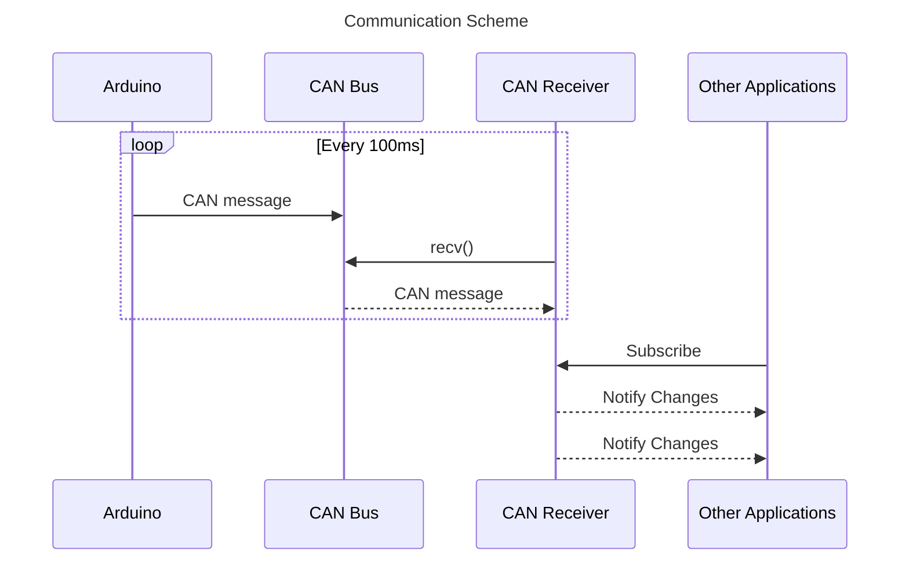

# Can Receiver
This application is responsible for receiving data from the CAN bus and provide received data to other applications via CommonAPI.

# Table of Contents
- [Communication Scheme](#communication-scheme)
- [Build and Install](#build-and-install)
- [FIDL](#fidl)
- [CI/CD](#cicd)
- [References](#references)

# Communication Scheme

Arduino RPM sensor sends CAN message to Raspberry Pi's CAN Bus every 100ms. CAN Receiver application uses socket can library and recv function to fetch CAN message from the CAN Bus. From the CAN message the application will interpret the bytes into numbers. Then it will use moving average filter to smoothen fluctuating values and convert RPM into speed(in this case m/min). These values are set to CommonAPI attributes defined in `.fidl` file.

# Build and Install
To build the project:<br/>Clone this repository and cd into the cloned repo.
```
mkdir build
cd build
cmake ..
make
```
Executable binary and `libCanReceiver-someip.so` will be created.<br/><br/>
To install:
```
sudo make install
```
This will install project's headers and dynamic library to the system and also provide cmake package so that other applications can easily include this project by using `find_package` in cmake.

# FIDL
```
package commonapi

interface SpeedSensor {
    version { major 0 minor 1 }

    attribute UInt32 speed readonly
    attribute UInt32 rpm readonly
}
```
These attributes can be accessed by other application. Use libCanReceiver-someip.so to build proxy.

# CI/CD
Since CommonAPI's IPC binding needs generated code according to `.fidl` or `.fdepl` files, github workflow is added in this project. Whenever changed `.fidl` or `.fdepl` file is pushed on main branch, github action will be triggered. IPC binding codes will be generated using Ubuntu x84_64 machine. The generated code is saved in the src-gen folder and committed and pushed to the repository automatically.

# References
- [Controller Area Network](https://en.wikipedia.org/wiki/CAN_bus)
- [SocketCAN](https://www.kernel.org/doc/html/latest/networking/can.html)
- [vsomeip in 10 minutes](https://github.com/COVESA/vsomeip/wiki/vsomeip-in-10-minutes)
- [CommonAPI wiki](https://github.com/COVESA/capicxx-core-tools/wiki)
- [Moving Average](https://en.wikipedia.org/wiki/Moving_average)
